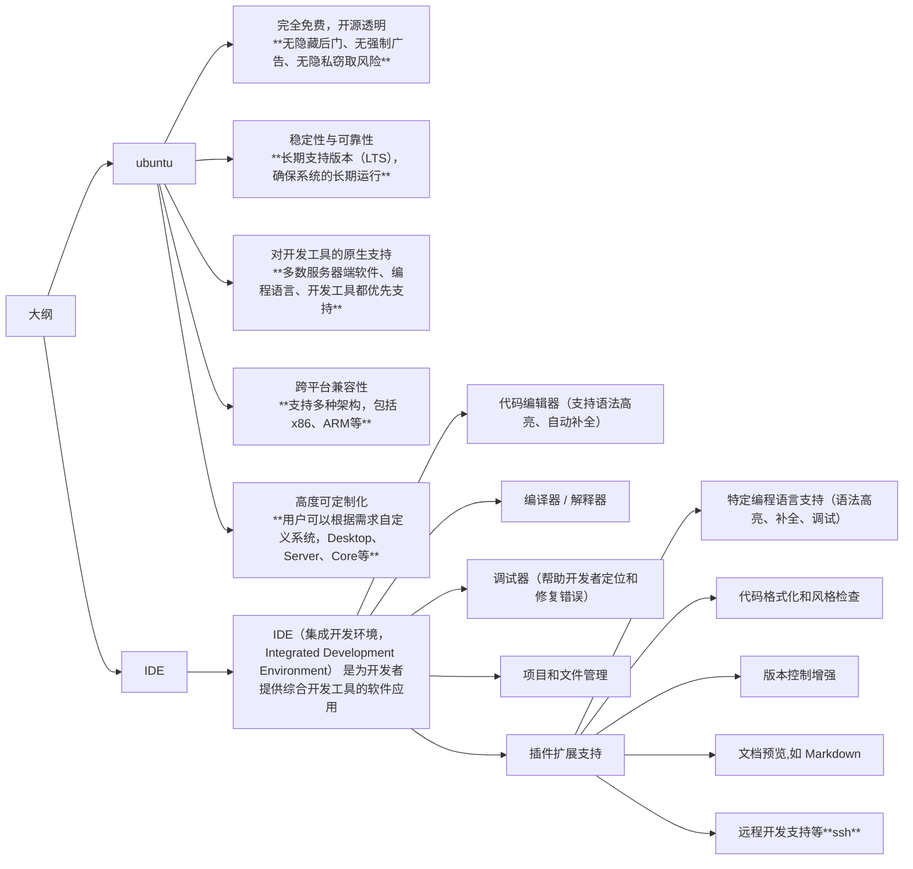

# 9.11 课程大纲

## 其它操作

- 更换软件源
- 打开shell配置文件
  - 打开终端
  - 输入`nano ~/.bashrc`
  - 输入`alias xx='nano ~/.bashrc`
  - 输入`source ~/.bashrc`
- git的安装
- vscode的安装
- git clone https://github.com/waliwuao/tutorial_ares.git
- 安装Markdown Preview Enhanced插件

